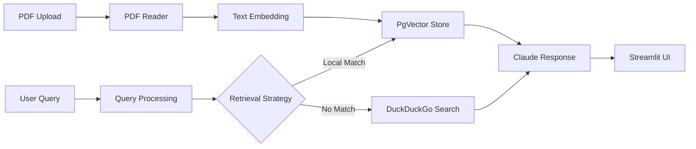

# AutoRAG: Autonomous RAG with GPT-4o

[](https://www.python.org/downloads/)
[](https://opensource.org/licenses/MIT)

An advanced autonomous retrieval-augmented generation (RAG) system combining document knowledge with real-time web search. Built with OpenAI's GPT-4o, PostgreSQL with PgVector, and Streamlit for an interactive interface.

## Features

- **Autonomous RAG**: Intelligent retrieval and generation without manual intervention
- **Document Knowledge Base**: Upload and process PDF documents for knowledge extraction
- **Web Search Integration**: Real-time web search using DuckDuckGo
- **Persistent Storage**: PostgreSQL with PgVector for efficient vector storage
- **Interactive Chat**: Streamlit-based conversational interface
- **Multi-Source Synthesis**: Combines document and web knowledge intelligently

## Architecture



## Tech Stack

- **Framework**: Agno AI Agent Framework
- **Language Model**: OpenAI GPT-4o-mini
- **Vector Database**: PostgreSQL with PgVector
- **Web Search**: DuckDuckGo integration
- **UI**: Streamlit
- **Document Processing**: PyPDF2

## Prerequisites

- Python 3.8 or higher
- OpenAI API key
- Docker (for PgVector database)

## Installation

1. Clone the repository:
```bash
git clone https://github.com/rchhabra13/01-ML-Projects-Collection.git
cd autonomous_rag
```

2. Create and activate virtual environment:
```bash
python -m venv venv
source venv/bin/activate  # On Windows: venv\Scripts\activate
```

3. Install dependencies:
```bash
pip install -r requirements.txt
```

4. Set up PgVector database with Docker:
```bash
docker run -d \
  -e POSTGRES_DB=ai \
  -e POSTGRES_USER=ai \
  -e POSTGRES_PASSWORD=ai \
  -e PGDATA=/var/lib/postgresql/data/pgdata \
  -v pgvolume:/var/lib/postgresql/data \
  -p 5532:5432 \
  --name pgvector \
  phidata/pgvector:16
```

5. Configure environment variables:
```bash
cp .env.example .env
# Edit .env and add your OpenAI API key
export OPENAI_API_KEY="your-api-key-here"
```

6. Run the application:
```bash
streamlit run autorag.py
```

7. Open your browser to `http://localhost:8501`

## Usage

### Document Upload
1. Navigate to the sidebar
2. Click "Upload PDF" button
3. Select a PDF file
4. Click "Add to Knowledge Base"

### Query the Assistant
1. Enter your question in the main text input
2. Click "Get Answer"
3. View the response generated from document knowledge and web search

### Example Queries
- "What are the main findings in this research paper?"
- "Summarize the key points from the business report."
- "Find current market trends related to this topic."

## Configuration

### Environment Variables (.env)
```bash
OPENAI_API_KEY=sk-your-api-key-here
DB_URL=postgresql+psycopg://ai:ai@localhost:5532/ai
```

### Customization
Edit `autorag.py` to modify:
- **LLM Model**: Change `gpt-4o-mini` to another OpenAI model
- **Chunk Size**: Adjust PDF text chunking parameters
- **Number of Retrieved Documents**: Modify `num_documents=3`
- **Search Instructions**: Update the `instructions` list

## Workflow

1. **Document Processing**: PDF documents are uploaded and processed
2. **Text Extraction**: Text is extracted from PDF pages
3. **Embedding Generation**: Text chunks are converted to vector embeddings
4. **Vector Storage**: Embeddings are stored in PgVector database
5. **Query Processing**: User queries are processed and analyzed
6. **Hybrid Retrieval**: Relevant documents retrieved; if insufficient, web search is initiated
7. **Response Generation**: GPT-4o synthesizes information from all sources
8. **Display**: Results are presented through the Streamlit interface

## Error Handling

- **Missing API Key**: Application stops and requests OpenAI API key
- **Database Connection Failures**: Logged and user is notified
- **PDF Read Errors**: Errors are caught and displayed to user
- **Query Failures**: Gracefully handled with logging and user notification

## Security & Privacy

- **Local Processing**: PDFs processed locally, not uploaded to external services
- **API Key Management**: Store API keys in `.env` file (never in code)
- **Database Security**: Use strong passwords for PostgreSQL
- **No Data Persistence**: Chat history stored in session state only

## Performance Features

- **Efficient Caching**: Streamlit's caching reduces redundant processing
- **Vector Search Optimization**: PgVector provides fast similarity search
- **Parallel Processing**: Concurrent document and web processing
- **Memory Management**: Efficient handling of large document collections

## Troubleshooting

### Database Connection Issues
```bash
# Check if PostgreSQL is running
docker ps | grep pgvector

# View database logs
docker logs pgvector
```

### API Key Errors
- Verify your OpenAI API key is valid
- Check that the key has sufficient quota
- Ensure no extra whitespace in the `.env` file

### Slow Performance
- Reduce chunk overlap in text splitting
- Decrease `num_documents` parameter
- Use smaller PDF files for initial testing

## Contributing

Contributions are welcome! Please:
1. Fork the repository
2. Create a feature branch (`git checkout -b feature/improvement`)
3. Make your changes
4. Add logging and error handling
5. Submit a pull request

## License

This project is licensed under the MIT License - see the [LICENSE](LICENSE) file for details.

## Support

For issues and questions:
- Create an issue on GitHub
- Check existing documentation
- Review the FAQ section

## Acknowledgments

- OpenAI for the GPT-4o language model
- Agno framework for agent orchestration
- Streamlit for the user interface
- PostgreSQL and PgVector for vector storage
- DuckDuckGo for web search capabilities

---

**Author**: Rishi Chhabra ([@rchhabra13](https://github.com/rchhabra13))

**Note**: This application is designed for educational and research purposes. Ensure you have the right to process and analyze the documents you upload.
